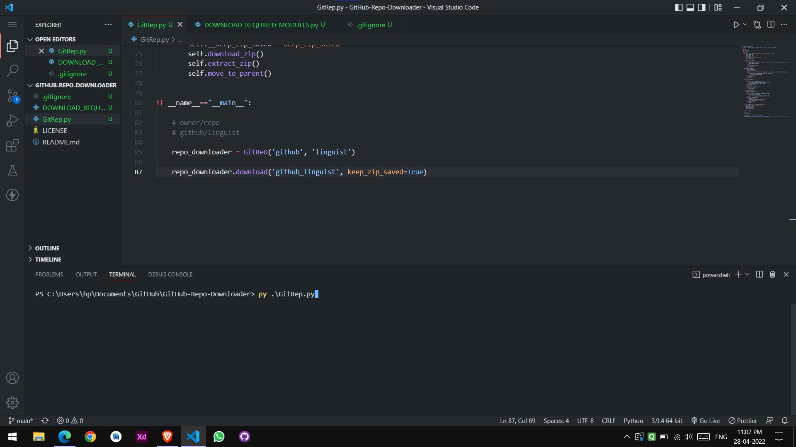
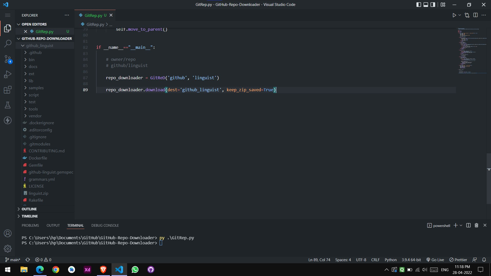

# GitHub-Repo-Downloader


# Input
Run [DOWNLOAD_REQUIRED_MODULES.py](./DOWNLOAD_REQUIRED_MODULES.py "DOWNLOAD_REQUIRED_MODULES.py") file to download required modules.

```shell
py DOWNLOAD_REQUIRED_MODULES.py
```

# Output


### Running [GitRep.py](./GitRep.py)


### You can see github_linguist folder has been created and [github/linguist](https://github.com/github/linguist "GitHub/Linguist") repository has been downloaded to local storage. And linguist.zip file is there because as specified not to delete inside [GitRep.py](./GitRep.py "GitRep.py") file.


```shell
py GitRep.py
```


```python
# Example
# Owner/repo
# github/linguist

repo_downloader = GitReD('github', 'linguist')

repo_downloader.download(dest='github_linguist', keep_zip_saved=True)
```

- NOTE: You may not be able to find the `github_linguist/` folder on this repository. Because I've included that folder into [.gitignore](.gitignore ".gitignore") file.

### Folder structure
```
root (If specified to make directory.)
| - specified_directory
    | - repo.zip (If specified to keep the zip file saved.)
    | - repository_file1.ext
    | - repository_file2.ext
    | - repository_file3.ext
    •
    •
    •
    | - repository_fileN.ext
```
---
```
root (If not specified to make directory.)
| - repo.zip (If specified to keep the zip file saved.)
| - repository_file1.ext
| - repository_file2.ext
| - repository_file3.ext
•
•
•
| - repository_fileN.ext
```


# Download using terminal using CURL

```sh
# First argv is owner name
# For exmaple github

# Second argv is repo name
# For exmaple linguist

# Third argv is to save inside folder or not
# If yes then True otherwise False
# DEFAULT IS True

# Fourth argv is to keep .zip file of repo or not
# If yes then True otherwise False
# DEFAULT IS False

# For example you want to download gihub/linguist repo
curl https://raw.githubusercontent.com/patelka2211/GitHub-Repo-Downloader/main/GitReD.sh | sh "github" "linguist" "True" "False"
```